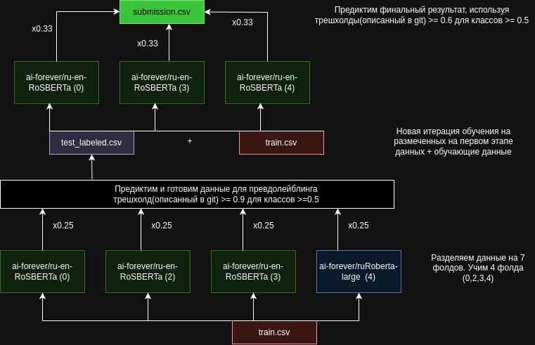

# etech-workshop-solution
The 6th place solution(rosberta+roberta blend + thresholds + pseudolabelling)

Паблик: 0.5760195035460993 (3 место)
Приват: 0.5685098823        (6 место)

# Инференс запущен на платфоре kaggle(для удобства)

https://www.kaggle.com/code/erdzhemadinov/etech-inference/ (последняя версия)

UPD: Я мимо проходил и на стажировку не претендую

# Описание решения

Общий пайплайн выглядит следующим образом:

 

### Алгоритм
## 1. Обучаем 4 фолда:
 - https://huggingface.co/ai-forever/ru-en-RoSBERTa   (0,1,2 - 3 фолда)
 - https://huggingface.co/ai-forever/ruRoberta-large   (4 - 1 фолд)

## 2. Усредняем предсказания ранее обученных моделей с одинаковыми весами(веса в зависимости от метрик не особо зашли). 

## 3. На их основе формируем выборку для псевдолеблинга(чтобы добавить их в обучение). 

### Стратегия выбора примеров для псевдолеблинга:

Цель:
Выбрать такое количество категорий, которое максимизирует вероятность того, 
что все категории в предсказании корректны.
При этом следует учитывать, что с каждой добавленной 
категорией общая вероятность корректности набора уменьшается. Задача взять такое количество примеров, 
чтобы вероятность была выше трешхолда 

Общая вероятность:
Вероятность корректности набора — это произведение вероятностей всех выбранных категорий,
так как все они должны быть верными одновременно. 
Чем больше категорий мы выбираем, тем ниже вероятность того, 
что весь набор окажется правильным.

Формула:
𝑃(категории) = 𝑃1 × 𝑃2 × ⋯ × 𝑃n, где P i  — вероятность i-й категории в наборе.

 - Инициализируем список для хранения выбранных меток.
 - Для каждой категории в списке проверяется, не превышено ли количество выбранных категорий и не упала ли общая вероятность ниже порога.
 - Вероятность корректности всего набора рассчитывается как произведение вероятностей выбранных категорий.
 - Если произведение вероятностей меньше порога, выбор прекращается.

Мы выбираем строку в следующий этап, если результат описанного выше алгоритма эквивалентен набору данных, поданных до.

Пример: [0.9, 0.9]  threshold 0.8
Строка попадёт в выборку для псевдолейблинга, т.к. 0.81 > 0.8

Пример: [0.9, 0.9, 0.5] threshold 0.8
Строка не попадёт в выборку для псевдолейблинга, т.к. 0.405 < 0.8

## 4. Добавляем данные, которые получены на первом этапе в выборку(файл test_labeled.csv). И обучаем 3 фолда. 

## 5. Блендим результаты с одинаковыми весами. При этом очищаем значения от тех которые меньше threshold по вероятности и по метке класса

Пример: [0.9, 0.9] threshold по вероятности 0.6, по классу 0.5
Строка не будет изменена и все категории останутся в финальном предикте

Пример: [0.9, 0.9, 0.6, 0.4] threshold по вероятности 0.6, по классу 0.5
Строка будет изменена следующим образом, на первом этапе удалим 0.4, т.к. 0.4<0.5, затем
очистим строку от 0.6 т.к. 0.9*0.9*0.6 < 0.6

И финальный предикт это лейблы с вероятностями [0.9, 0.9]

UPD: Если в метках в результате не осталось ни одного примера(например все вероятности были слишком маленькими),

То оставим один предикт с наибольшей вероятностью, т.к. пустых предиктов в тесте нет.

## 6. Объединяем пайплайн, генерируем сабмит и отправляем в тестирующую систему.

## Публичные скоры(по этапам)

1: 1 fold Ro-SBERTA + трешхолд на категории 0.5323581560283688

2: Blend 4 фолда 0.5598404255319149

3: + Threshold на вероятности 0.5700354609929078

4: + Псевдолейблинг 0.5760195035460993		

